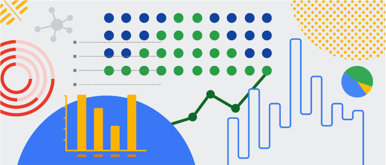

## The Power of Data Visualization

Effective data analysis involves not only organizing your data but also effectively communicating your findings. In this discussion, we will explore various resources for impactful data visualization, enabling you to select the most suitable approach to present your data.

**Data visualization** is the art of representing data graphically. Why is this crucial for data analysts, you might wonder? Well, often, your audience may not possess the expertise to decipher complex information. Thus, your responsibility is to convey your analysis in a manner that is clear, engaging, and easy to comprehend. The effectiveness of data visualization lies in its ability to capture people's attention through colors, shapes, and patterns, allowing you to tell a compelling story beyond mere numbers.

To truly appreciate the significance of data visualization, let's explore some practical examples. As a junior data analyst, having an array of visualization tools at your disposal is invaluable. Below, you'll find a compilation of resources that can both inspire your data-driven decisions and teach you how to make your data more accessible to your audience:

- [The Data Visualization Catalogue](https://datavizcatalogue.com/#google_vignette): If you're unsure where to begin with data visualization, this catalogue showcases a variety of diagrams, charts, and graphs to help you choose the most appropriate one for your project. Each category provides a detailed description of the visualization, its function, and a list of similar visuals.

- [The 30 Best Data Visualizations](https://visme.co/blog/best-data-visualizations/): Explore a collection of exceptional data visualizations that transform complex data into stunning visuals. Click on the links below each image to delve deeper into each project and understand why making data visually appealing is paramount.

- [Top 10 Visualization Blogs](https://www.tableau.com/learn/articles/best-data-visualization-blogs): Each link leads you to a blog filled with valuable insights, covering everything from data storytelling to graphic data. Whether you're seeking inspiration or practical knowledge, these blogs are a valuable resource.

- [Information Is Beautiful](https://informationisbeautiful.net/wdvp/gallery-2019/): Founded by David McCandless, this gallery is dedicated to aiding you in making informed visual decisions based on facts and data. It showcases projects created by students, designers, and data analysts, offering insight into how they transformed their data into compelling visual narratives.

- [Data Studio Gallery](https://lookerstudio.google.com/gallery?category=visualization): Information is crucial, but presenting it in a digestible format is even more powerful. Explore this interactive gallery to discover various examples of data presented visually. You can even use the Data Studio tool to create your own data-driven visuals.

## Captivate Your Audience

Remember, a key aspect of being a data analyst is the ability to convey your findings in a way that resonates with your audience. Data visualization can simplify even the most intricate and tedious information, making it easily understandable. Mastering data visualization is a valuable skill because your ultimate goal is to invite your audience into a conversation with the data. This is particularly important when dealing with extensive datasets, such as the global flow of goods between countries.
